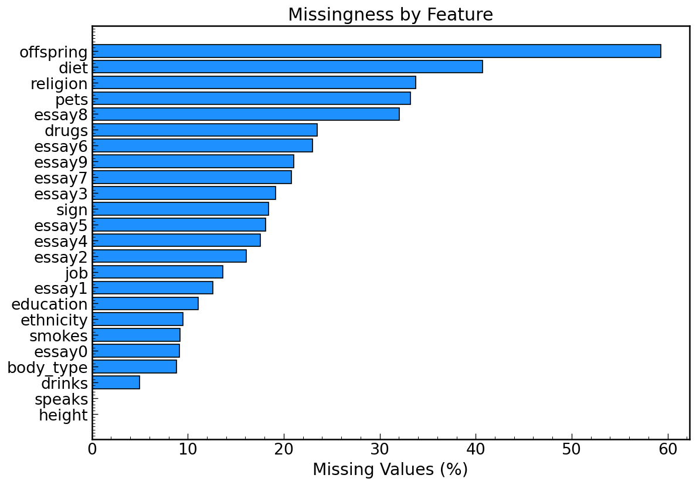
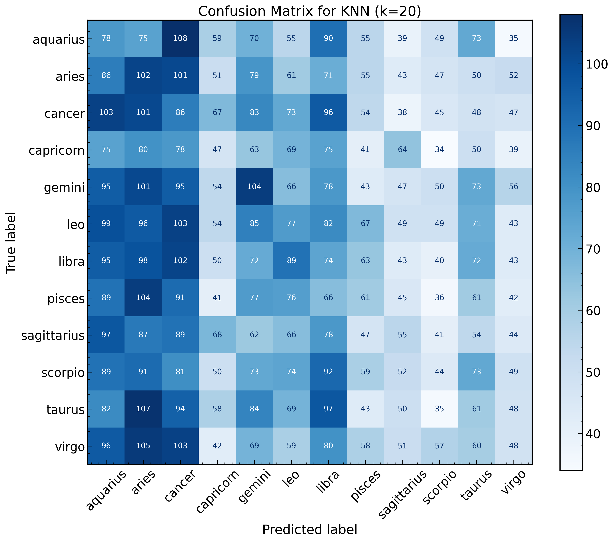
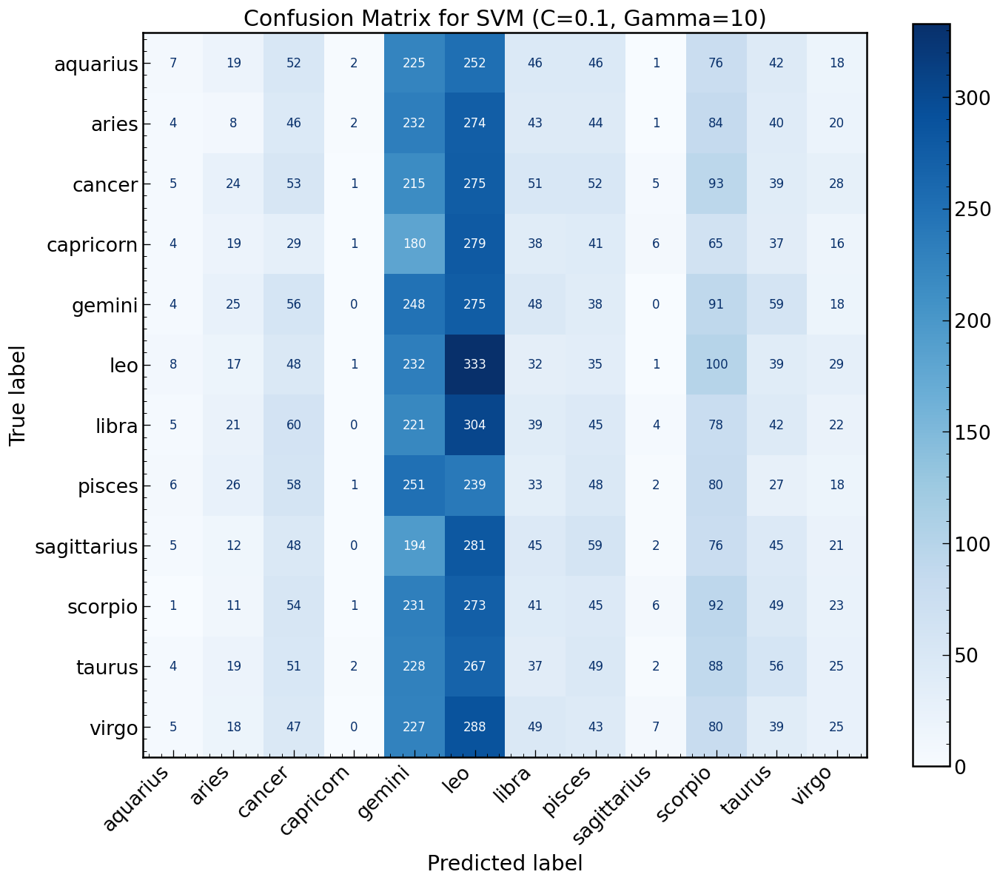

## The Problem

When I first looked at this dataset I noticed that about 18.4% of OKCupid profiles  are missing a zodiac sign. That might not sound like a big deal, but zodiac compatibility is something a lot of users actually care about when choosing matches.

So I asked myself: can I use the lifestyle and demographic information that users did fill in to predict what their zodiac sign might be?

## The Dataset

I worked with 59,946 OKCupid profiles and 31 columns covering:

- Demographics like age and height
- Lifestyle choices like drinking, smoking, and diet
- Education and job information
- 10 open ended essay responses

The target variable was the `sign` column, which was missing for about 18.4% of users.

## Exploring the Data

Before jumping into modeling, I spent some time getting familiar with the dataset.  The first thing I wanted to understand was how much data was missing and which features were most affected.

{width=90%}

A few things stood out right away. The `offspring` column was missing for nearly  60% of users, and several of the essay columns were missing for 20-30% of users.  The `sign` column, which is what I was trying to predict, was missing for 18.4% of profiles.

## Exploring the Data (cont.)

The next thing I looked at was the distribution of zodiac signs across the dataset.  The signs are fairly evenly distributed which is good news for modeling since it  means the model won't be heavily biased toward one sign just because it appears  more often.

- Most common sign: **Leo** with 4,374 profiles
- Least common sign: **Capricorn** with 3,573 profiles
- Baseline accuracy if we just guessed the most common sign: **8.3%**

That 8.3% baseline is really important. It's the number every model needs to beat to be considered useful at all.

## The Question {smaller=true}

After exploring the data, I landed on this question:

> Can I predict a user's zodiac sign from their lifestyle and demographic information?

I chose this because zodiac signs are important to a lot of OKCupid users for compatibility matching, but 18.4% of profiles have that field blank. If I could predict it reasonably well, those missing signs could be filled in automatically and improve match quality.

I treated this as a **multi-class classification** problem with 12 possible  output classes, one for each zodiac sign. The features I used were:

- Age
- Drinking habits
- Smoking habits
- Body type
- Education level

I intentionally left out diet since it was missing for 38% of users, which was too high to be reliable.

## Feature Engineering: Education

One of the more interesting challenges was the `education` column. It had 33 unique  values like "graduated from college/university" and "dropped out of masters program". I needed to convert these into something a model could actually use.

I wrote a custom function that extracts the highest level of education completed.  The twist was handling dropouts. If someone dropped out of college, their highest  completed level is actually high school, not college. So I built that logic in:

- 0 = dropped out of high school
- 1 = high school
- 2 = two-year college
- 2.5 = space camp (its own thing!)
- 3 = college/university
- 4 = masters
- 5 = ph.d, law, or med

## Feature Engineering: Drinking Habits

The `drinks` column had values like "not at all" "socially", "often" and  "desperately". These have a natural order to them so I used sklearn's `OrdinalEncoder` to convert them into numbers while preserving that order.

I did the same thing for smoking and body type. The key insight here is that not all categorical variables are the same. Some have a natural order like drinking frequency, and some don't like diet type. Choosing the right encoding  method for each one matters.

- not at all → 0
- rarely → 1
- socially → 2
- often → 3
- very often → 4
- desperately → 5

## Model Comparison: KNN vs SVM

I tried three classification models in total but will focus on comparing KNN and SVM here since they had the most interesting differences.

| | KNN (k=20) | SVM (C=0.1, Gamma=10) |
|---|---|---|
| Accuracy | 8.6% | 9.3% |
| Macro F1 | 0.08 | 0.07 |
| Time to run | Fast | Slow (5-15 mins) |
| Simplicity | Simple | Complex |

## Model Comparison: KNN vs SVM (cont.)

On paper SVM wins on accuracy. But looking at the confusion matrices tells  a different story.

:::: {.columns}
::: {.column width="50%"}

:::
::: {.column width="50%"}

:::
::::

KNN at least spread its predictions across all 12 signs. SVM basically  learned to just predict gemini and leo for almost everyone. Higher accuracy  does not always mean a better model.

## Model Comparison: KNN vs SVM (cont.)

**KNN** finds the K most similar users and takes a majority vote among their signs. It is simple, intuitive and fast to run. The downside is it struggles when there is no real pattern in the data, which is exactly what happened here.

**SVM** tries to find the best boundary between classes in feature space. It is more powerful than KNN and takes much longer to run, especially with  GridSearchCV tuning across 36 parameter combinations.Despite that extra complexity it only improved accuracy by 0.7% and actually had a worse F1 score.

The takeaway for me was that complexity does not always equal better results. Sometimes a simpler model is just as good or better.

## Conclusion

Honestly the results were not surprising once I thought about it. Zodiac signs are determined by birthday, not by lifestyle choices. There is no real reason why someone who drinks socially and has a college degree should be more likely to be a gemini than a scorpio.

All three models performed right around the random guessing baseline of 8.3%:

| Model | Accuracy | Macro F1 |
|---|---|---|
| Baseline | 8.3% | - |
| KNN (k=20) | 8.6% | 0.08 |
| GaussianNB | 8.8% | - |
| SVM (C=0.1, Gamma=10) | 9.3% | 0.07 |
| CategoricalNB (Alpha=2.0) | 9.5% | 0.07 |

The biggest lesson I took away from this project is that accuracy alone does not tell the whole story. I had to look at confusion matrices and classification  reports together to really understand what each model was doing.

## Next Steps

If I were to do this project again there are a few things I would change:

**Different target variable** - predicting something like drinking habits or smoking status from the other features would likely yield much stronger results since those variables have real relationships with lifestyle and demographic factors.

**Natural language processing** - the 10 essay columns contain a huge amount of untapped information. Using NLP techniques on those responses could reveal personality patterns that structured data cannot capture.

**Better features** - the most reliable way to fill in missing zodiac signs would actually be to just ask users for their birthday. Sometimes the simplest solution really is the best one.